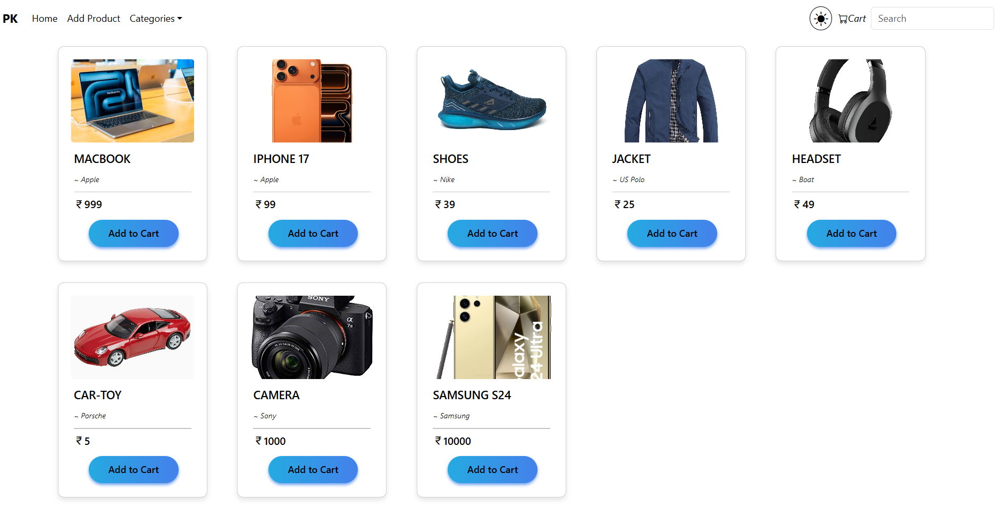
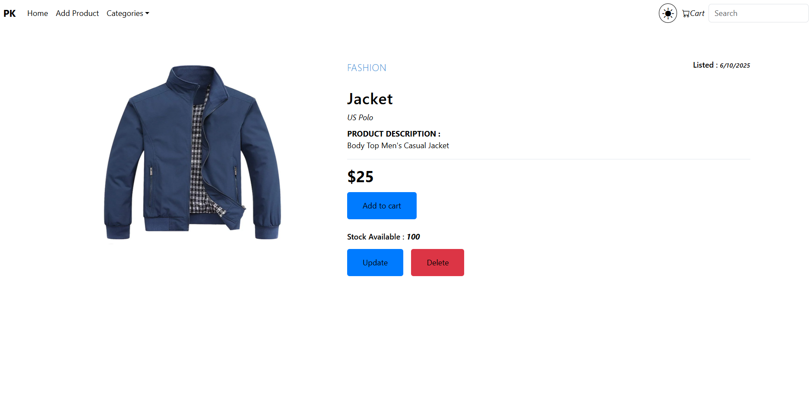
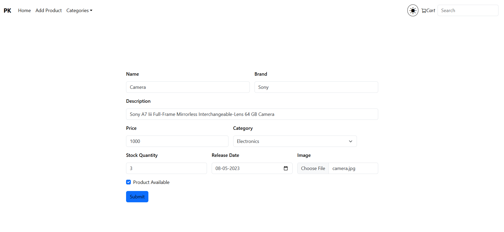
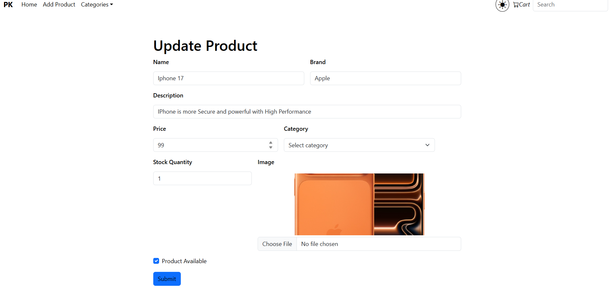
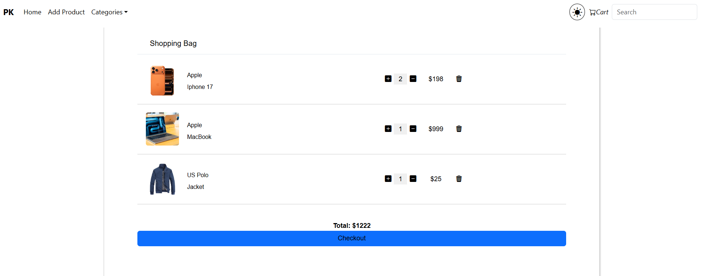
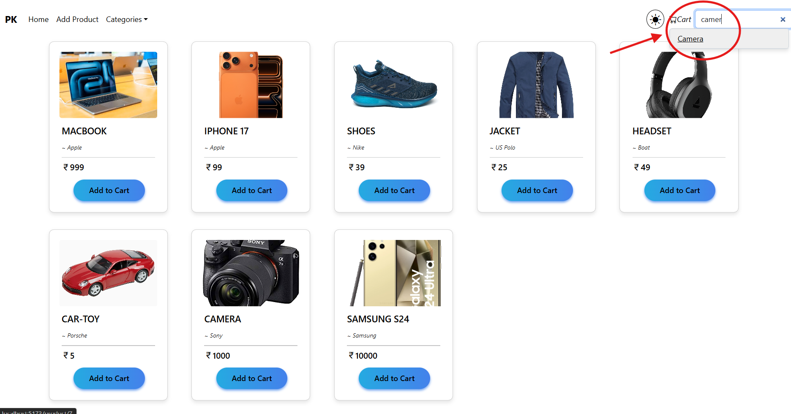

# E-Commerce Application - Spring Boot & React

A full-stack e-commerce web application built with Spring Boot (Backend) and React (Frontend), featuring product management, shopping cart functionality, and image handling capabilities.

[](https://spring.io/projects/spring-boot)
[](https://reactjs.org/)
[](https://www.oracle.com/java/)
[](https://www.mysql.com/)

## 📋 Table of Contents

- [Screenshots](#-screenshots)
- [Features](#-features)
- [Technology Stack](#-technology-stack)
- [Prerequisites](#-prerequisites)
- [Installation](#-installation)
- [Configuration](#-configuration)
- [Running the Application](#-running-the-application)
- [API Endpoints](#-api-endpoints)
- [Project Structure](#-project-structure)
- [Contributing](#-contributing)
- [License](#-license)

## 📸 Screenshots

### Home Page - Product Listing


### Product Details


### Add Product (Admin)



## Update Product (Admin)



### Shopping Cart


### Search Functionality


## ✨ Features

### Core Functionality
- 🛍️ **Product Management**: Complete CRUD operations for products
- 🖼️ **Image Upload & Storage**: Store product images in MySQL database as LONGBLOB
- 🔍 **Advanced Search**: Search products by name, description, brand, or category
- 🛒 **Shopping Cart**: Add products to cart with quantity management
- 📱 **Responsive Design**: Bootstrap-based responsive UI
- 🔄 **Real-time Updates**: Dynamic product listing and filtering
- 🏷️ **Category Filtering**: Filter products by categories

### Technical Features
- RESTful API architecture
- CORS enabled for frontend-backend communication
- File upload handling (multipart/form-data)
- JPA/Hibernate for database operations
- Context API for state management
- React Router for client-side routing

## 🛠️ Technology Stack

### Backend
- **Framework**: Spring Boot 3.2.1
- **Language**: Java 21
- **Database**: MySQL 8.0+
- **ORM**: Spring Data JPA / Hibernate
- **Build Tool**: Maven
- **Libraries**:
  - Spring Web (REST APIs)
  - Spring Data JPA
  - MySQL Connector
  - Lombok 1.18.30
  - Spring DevTools

### Frontend
- **Framework**: React 18.2.0
- **Build Tool**: Vite 5.2.8
- **UI Library**: Bootstrap 5.3.3, React Bootstrap 2.10.2
- **Routing**: React Router DOM 6.22.3
- **HTTP Client**: Axios 1.6.8
- **Icons**: React Icons, Bootstrap Icons
- **Styling**: CSS, SASS

## 📦 Prerequisites

Before running this application, make sure you have the following installed:

- **Java Development Kit (JDK)** 21 or higher
- **Node.js** 18.x or higher
- **npm** or **yarn** package manager
- **MySQL** 8.0 or higher
- **Maven** 3.6+ (or use the included Maven wrapper)
- **Git** (for cloning the repository)

## 🚀 Installation

### 1. Clone the Repository

```bash
git clone https://github.com/Prashanth291/E-Commerce-SpringBoot.git
cd E-Commerce-SpringBoot
```

### 2. Database Setup

Create a MySQL database:

```sql
CREATE DATABASE ecommerceDB;
```

### 3. Backend Setup

Navigate to the backend directory:

```bash
cd BACKEND
```

Update database credentials in `src/main/resources/application.properties`:

```properties
spring.datasource.url=jdbc:mysql://localhost:3306/ecommerceDB
spring.datasource.username=YOUR_MYSQL_USERNAME
spring.datasource.password=YOUR_MYSQL_PASSWORD
```

Build the backend:

```bash
# Using Maven wrapper (recommended)
./mvnw clean install

# Or using installed Maven
mvn clean install
```

### 4. Frontend Setup

Navigate to the frontend directory:

```bash
cd ../FRONTEND
```

Install dependencies:

```bash
npm install
# or
yarn install
```

## ⚙️ Configuration

### Backend Configuration

The main configuration file is located at `BACKEND/src/main/resources/application.properties`:

```properties
# Application Name
spring.application.name=e-commerce

# Database Configuration
spring.datasource.url=jdbc:mysql://localhost:3306/ecommerceDB
spring.datasource.username=root
spring.datasource.password=YOUR_PASSWORD
spring.datasource.driver-class-name=com.mysql.cj.jdbc.Driver

# JPA Configuration
spring.jpa.show-sql=true
spring.jpa.hibernate.ddl-auto=update
spring.jpa.defer-datasource-initialization=true
```

### Frontend Configuration

API base URL is configured in `FRONTEND/src/axios.jsx`:

```javascript
const API = axios.create({
  baseURL: "http://localhost:8080/api",
});
```

CORS is configured in `BACKEND/src/main/java/com/prashanth/e_commere/config/WebConfig.java` to allow requests from `http://localhost:5173`.

## ▶️ Running the Application

### Start the Backend

```bash
cd BACKEND

# Using Maven wrapper
./mvnw spring-boot:run

# Or using installed Maven
mvn spring-boot:run
```

The backend will start on **http://localhost:8080**

### Start the Frontend

In a new terminal:

```bash
cd FRONTEND

# Start development server
npm run dev
# or
yarn dev
```

The frontend will start on **http://localhost:5173**

### Access the Application

Open your browser and navigate to:
- **Frontend**: http://localhost:5173
- **Backend API**: http://localhost:8080/api

## 📡 API Endpoints

### Product Endpoints

| Method | Endpoint | Description |
|--------|----------|-------------|
| GET | `/api/products` | Get all products |
| GET | `/api/product/{id}` | Get product by ID |
| GET | `/api/product/{id}/image` | Get product image |
| POST | `/api/product` | Create new product (multipart/form-data) |
| PUT | `/api/product/{id}` | Update product (multipart/form-data) |
| DELETE | `/api/product/{id}` | Delete product |
| GET | `/api/products/search?keyword={keyword}` | Search products |

### Request Examples

#### Create Product

```bash
POST /api/product
Content-Type: multipart/form-data

{
  "product": {
    "name": "iPhone 15",
    "description": "Latest Apple smartphone",
    "brand": "Apple",
    "category": "Electronics",
    "price": 79999.00,
    "stockQuantity": 50,
    "productAvailable": true,
    "releaseDate": "2024-09-20"
  },
  "imageFile": <binary-file>
}
```

#### Search Products

```bash
GET /api/products/search?keyword=apple
```

## 📁 Project Structure

```
E-Commerce-SpringBoot/
│
├── BACKEND/                              # Spring Boot Backend
│   ├── src/
│   │   ├── main/
│   │   │   ├── java/com/prashanth/e_commere/
│   │   │   │   ├── config/               # Configuration classes
│   │   │   │   │   └── WebConfig.java    # CORS configuration
│   │   │   │   ├── controller/           # REST Controllers
│   │   │   │   │   └── ProductController.java
│   │   │   │   ├── model/                # Entity models
│   │   │   │   │   └── Product.java
│   │   │   │   ├── repository/           # JPA Repositories
│   │   │   │   │   └── ProductRepository.java
│   │   │   │   ├── service/              # Business logic
│   │   │   │   │   └── ProductService.java
│   │   │   │   └── ECommereApplication.java
│   │   │   └── resources/
│   │   │       ├── application.properties
│   │   │       └── data1.sql             # Sample data
│   │   └── test/                         # Unit tests
│   ├── pom.xml                           # Maven dependencies
│   └── mvnw, mvnw.cmd                    # Maven wrapper
│
├── FRONTEND/                             # React Frontend
│   ├── public/                           # Static assets
│   ├── src/
│   │   ├── components/                   # React components
│   │   │   ├── Home.jsx                  # Product listing
│   │   │   ├── Product.jsx               # Product details
│   │   │   ├── AddProduct.jsx            # Add product form
│   │   │   ├── UpdateProduct.jsx         # Update product form
│   │   │   ├── Cart.jsx                  # Shopping cart
│   │   │   └── Navbar.jsx                # Navigation bar
│   │   ├── Context/
│   │   │   └── Context.jsx               # Global state management
│   │   ├── assets/                       # Images, icons
│   │   ├── App.jsx                       # Main app component
│   │   ├── main.jsx                      # Entry point
│   │   ├── axios.jsx                     # Axios configuration
│   │   ├── App.css                       # App styles
│   │   └── index.css                     # Global styles
│   ├── package.json                      # npm dependencies
│   └── vite.config.js                    # Vite configuration
│
└── README.md                             # This file
```

## 🎯 Key Components

### Backend

- **ProductController**: Handles HTTP requests and responses
- **ProductService**: Contains business logic for product operations
- **ProductRepository**: JPA repository for database operations
- **Product Entity**: JPA entity representing product table
- **WebConfig**: CORS configuration for frontend communication

### Frontend

- **Home**: Displays product grid with category filtering
- **Product**: Shows individual product details
- **AddProduct**: Form to add new products with image upload
- **UpdateProduct**: Form to edit existing products
- **Cart**: Shopping cart with quantity management
- **Navbar**: Navigation with category selection
- **Context**: Global state management using React Context API

## 🎨 Features in Detail

### Product Management
- Add new products with image upload
- Edit existing products and update images
- Delete products
- View all products in a responsive grid layout
- View individual product details

### Shopping Cart
- Add products to cart
- Increase/decrease product quantity
- Remove products from cart
- Persistent cart state using Context API

### Search & Filter
- Search products by keyword (searches across name, description, brand, category)
- Filter products by category
- Real-time search results

### Image Handling
- Upload product images during creation
- Update product images
- Store images in MySQL database as LONGBLOB
- Retrieve and display images with proper content type

## 🔧 Build & Deployment

### Build Backend for Production

```bash
cd BACKEND
./mvnw clean package
```

The JAR file will be created in `target/e-commerce-0.0.1-SNAPSHOT.jar`

Run the JAR:

```bash
java -jar target/e-commerce-0.0.1-SNAPSHOT.jar
```

### Build Frontend for Production

```bash
cd FRONTEND
npm run build
# or
yarn build
```

The production build will be created in the `dist/` directory.

## 🤝 Contributing

Contributions are welcome! Please follow these steps:

1. Fork the repository
2. Create a new branch (`git checkout -b feature/YourFeature`)
3. Commit your changes (`git commit -m 'Add some feature'`)
4. Push to the branch (`git push origin feature/YourFeature`)
5. Open a Pull Request


## 👨‍💻 Author

**Prashanth**
- GitHub: [@Prashanth291](https://github.com/Prashanth291)
- Email: [prashanthbollinedi2910@gmail.com](mailto:prashanthbollinedi2910@gmail.com)
- Repository: [E-Commerce-SpringBoot](https://github.com/Prashanth291/E-Commerce-SpringBoot)

## 🙏 Acknowledgments

- Spring Boot documentation
- React documentation
- Bootstrap team for the UI framework
- All contributors and users of this project

---

⭐ If you found this project helpful, please give it a star!
